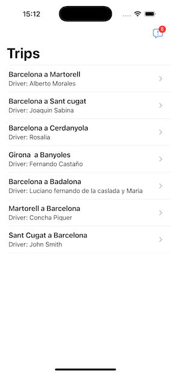
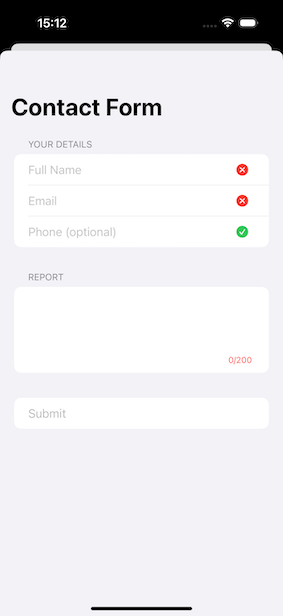
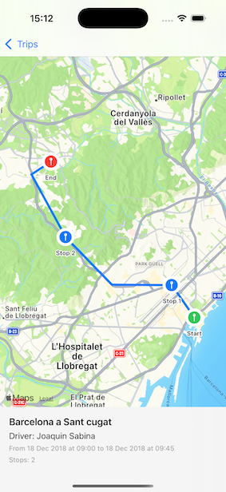
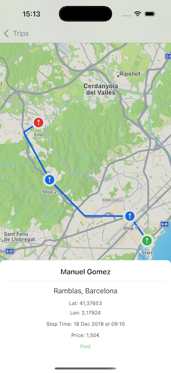

# TripManager

TripManager is an iOS technical challenge built using **Swift 5** and **SwiftUI**, targeting **iOS 17+**.  
The goal is to create a small, scalable travel management app capable of:

- Displaying a list of trips.
- Showing the route of a selected trip on a map.
- Displaying stop information when tapped.
- Allowing users to submit a report through a validated contact form.
- Updating the app badge with the number of submitted reports.

---

## 📱 Screenshots

| Trip List | Contact Form |
|-----------|---------------|
|  |  |

| Trip Map | Stop Info |
|----------|------------|
|  |  |

---

## 🧱 Architecture

The project follows **Clean Architecture** principles with clear separation of concerns:

- **Presentation Layer (SwiftUI + ViewModels)**: UI rendering and state handling.
- **Domain Layer (UseCases + Models)**: Core business logic.
- **Data Layer (Repositories + Services + Stores)**: Data access (local and remote).
- **Dependency Injection**: Centralized via `AppDIContainer`.

---

## 🧪 Testing

The project includes:

- ✅ Unit tests for ViewModels, UseCases, Repositories, Mappers and Storage.
- ✅ UI tests validating navigation, form interaction and map presentation.
- ✅ Test coverage on all key layers.

---

## 🔧 Tech Stack

- `Swift 5`
- `SwiftUI`
- `MapKit`
- `UserNotifications`
- `Polyline` (SPM) – for route decoding
- `XCTest` and `XCUITest` – for unit and UI testing

---

